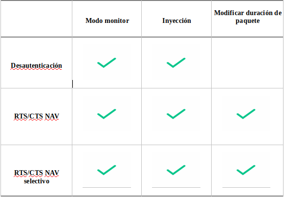
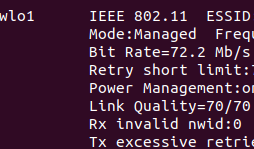
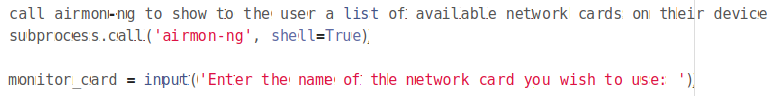
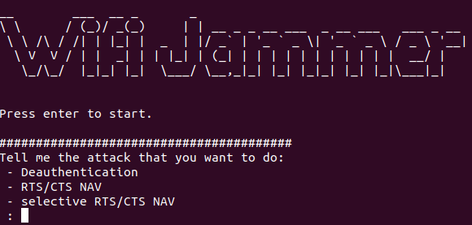
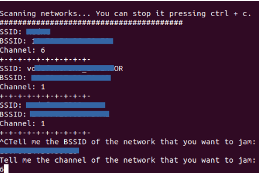
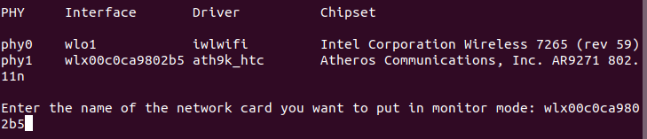
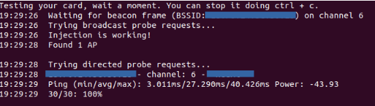
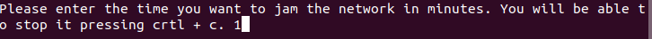
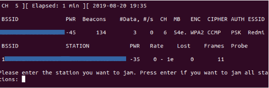
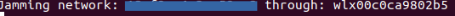

## User guide

This manual will show an example of running the application and exposing cases in which the application could not function properly.

## Conflicting cases

There are certain requirements discussed above that the user needs to carry out the attacks correctly, since not all network cards allow all the necessary operations. Table 1 shows the needs of the network card for each attack.

Tabla 1

## Modo monitor

To know if our card supports the monitor mode, first we will install the project dependencies, located in the root directory of the application, with the command:
- make install
and we also install the library:
- sudo apt install wireless-tools
Once the dependencies are installed, we execute the command:
- iwconfig
Looking at the network cards, we look at "mode" and see that it puts "managed" as seen in Figure 1. Then we execute the following command:
- sudo airmon-ng start “card_name”
We rerun the command:
- iwconfig
We should note that in "mode", where before put "managed" now puts "monitor". If not, our card does not support monitor mode.

Figure 1

To change the functions that put and remove the network card in monitor mode, the user must first go to the "view.py" file located in src / view. In the file, the lines from 86 to 89 are uncommented, which are as seen in Figure 2.

Figure 2

Next we go to the file “controller.py” located in the src / controller directory, we comment on the functions “monitor_mode” and “quit_monitor_mode” that are found from line 43 to line 53. We comment on the functions mentioned “monitor_mode” and “Quit_monitor_mode” found from line 37 to 41.
This offers another alternative in case the commands used in some functions do not work correctly on the user's computer.

## Injection

Having installed the project dependencies, we can verify that our network card can inject with the command:
- sudo aireplay-ng –test “card_name”
This command will show through the terminal the networks to which it is injecting in case your network card is suitable, and in case it is not, it will indicate it.
If the network card manages to get into monitor mode and inject, the first Deauthentication attack can be performed.

## Modify package duration

Most of network cards are capable of supporting the previous two points, but when we talk about modifying the certain fields of a package, few are suitable for this.
It would be difficult to make a list of all the network cards that are suitable, since it depends on several factors of which the most important is the driver that it has installed.
The Scapy library allows the creation of packages where you can modify any field at the user's discretion, but it happens that the driver of most network cards make their own calculations of what the duration of the package should be and modify it before injecting it.
Being in contact with developers and vendors, testing several cards with different drivers, I can affirm that any card that has the ath9k_htc driver allows the modification of the duration field.
The only way to check if the network card allows this attack is to execute it, and with a different network card use a network analyzer, such as wireshark, and verify that the packet injected into the network has the correct duration, as is You can see in Figure 3. If your network card does not allow the modification of the duration field, the duration of the package can be from 0 to any other than the expected one (32767 microseconds).

Figure 3

## Execution example

An example of a Deauthentication attack execution will be shown to show how the process should be.
First, we downloaded the project from the Github repository [17] and placed ourselves in the root directory.
We execute the command to install the dependencies:
- make install
Next, we run the application (See Figure 4):
- make run

Figure 4

We indicate the type of attack, in this case Deauthentication.
Then the scanner of nearby Wi-Fi networks will start (See Figure 5), we stop it with the keyboard shortcut "ctrl + c" and enter your BSSID and its channel.

Figure 5

After this we will be shown the available network cards (See Figure 6), write one of them and then indicate that it is being put in monitor mode:

Figure 6

After putting the network card in monitor mode, the test will start (See Figure 7). To know that it is working correctly, you must inject only the selected network and the selected channel:

Figure 7

Next, you will be asked for the desired execution time, as shown in Figure 8.

Figure 8

Finally, before starting to do jamming, you must indicate the station on which to do jamming, for this a scanner will come out that we must stop using the keyboard shortcut “ctrl + c” and then indicate it, as seen in Figure 9.

Figure 9

Once the station is indicated, the jamming begins (See Figure 8.10):

Figure 9
